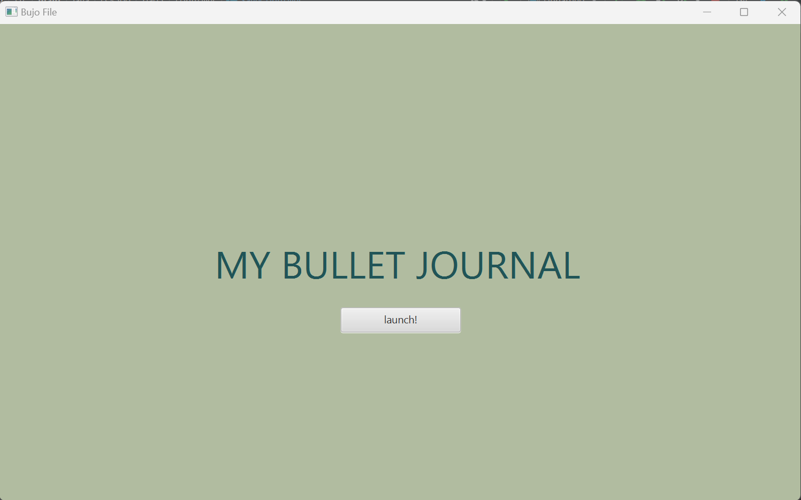
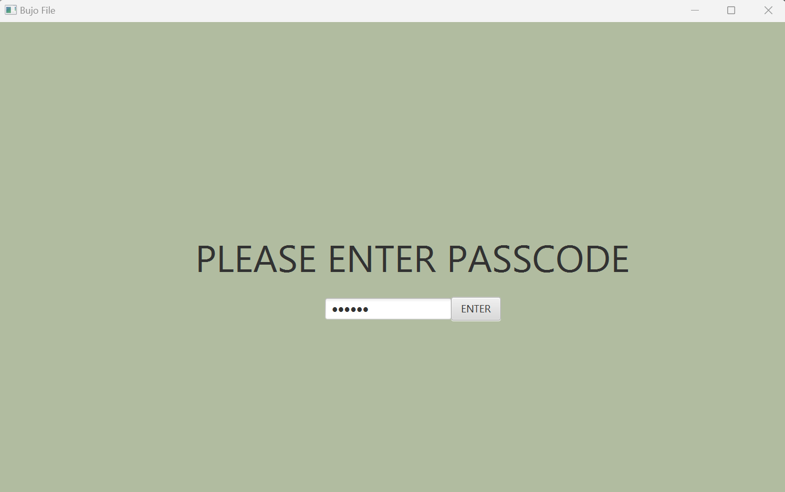
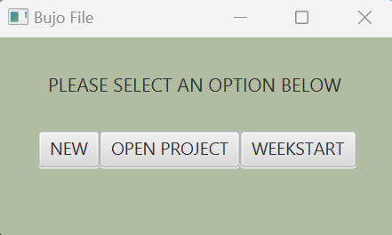
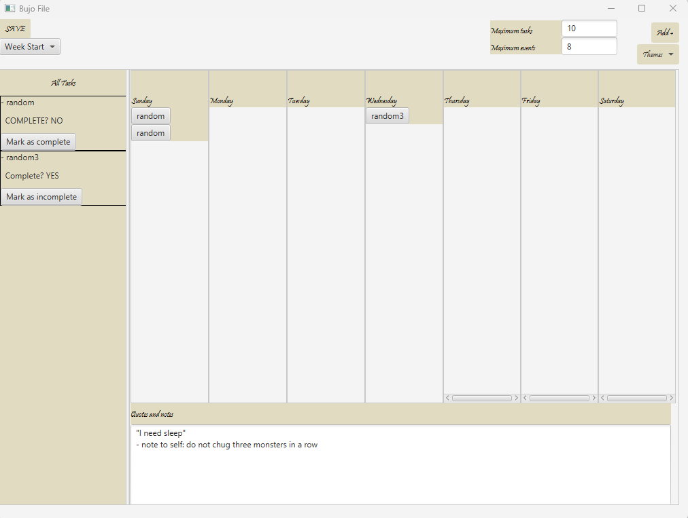

# 3500 PA05 Project Repo

[PA Write Up](https://markefontenot.notion.site/PA-05-8263d28a81a7473d8372c6579abd6481)
initial GUI

Introducing NicoleNamTony's Bullet Journal, the World's BEST bullet journal application. Our user-friendly bullet 
journal app is perfect for those who seeks to EFFORTLESSLY increase their organization and productivity levels. With
our top of the line features, we guarantee the best for all of our users.

Download NicoleNamTony's Bullet Journal now and experience the once in the lifetime opportunity to say goodbye to
unorganized chaos and low productivity levels!

## Features
- Week View: The view of the spread of an entire week!
- Event and Task Creation: Create tasks and events with all the information you want
- Persistence: Need to leave the application? Save your application via the Save button!
- Commitment Warnings: Set limits to the amount of tasks and events you can personally create
- Task Queue: Adding up all tasks for an entire week is too much. Why not have a sidebar with all of it? Oh yes, we do!
- Themes: One default theme is boring! We have plenty of themes to keep the journal spiced up!
- Quotes & Notes: Keep track of any quotes to keep you motivated or any notes to keep to yourself!
- Mini Viewer: In depth information about your created task(s) or event(s)!
- Takesie-Backsies: Have the ability to delete any task or event as freely as you want
- Week Start: Be able to choose what day to start you week off on.
- Links: Need to associate a Task or Event with a link? That link will be usable and clickable!
- Visual Flourish: Visual pleasure to keep bullet journaling fun!
- Splash Screen: A welcome screen to warmly welcome you to the application!
- Privacy Lock: Keep your bullet journal safe with a password lack to prevent your entries to be safe to just you!
- Weekly Starters: Got a nice looking bullet journal file? No problem! Import any .bujo file and use it as a template!

### Screenshots of GUI features

